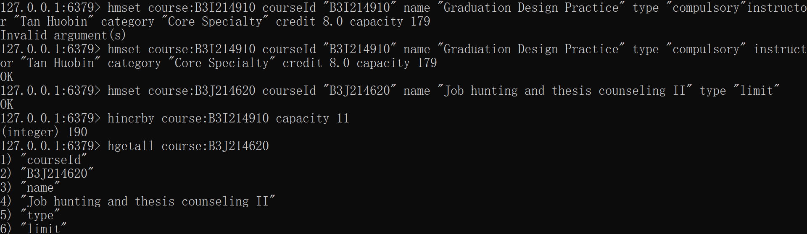

# Task 1


安装成功

# Task2

**因为会出现奇怪的韩文，所以就把汉字全部换成英文了**

## 1.

```
hmset student:19373073 name "He Xiaolong" age 20 class "192112" major "Software Engineering"
```


## 2.

```
hmset course:B3I214910 courseId "B3I214910" name "Graduation Design Practice" type "compulsory" instructor "Tan Huobin" category "Core Specialty" credit 8.0 capacity 179
hmset course:B3J214620 courseId "B3J214620" name "Job hunting and thesis counseling II" type "limit"
instructor "Tan Huobin" category "General Specialty" credit 1.0 capacity 179

hincrby course:B3I214910 capacity 11
hgetall course:B3J214620
```



## 3.

```
sadd course:B3I214910:students "19373073" "19373001" "19373002"
sadd course:B3J214620:students "19373002" "19373003"
sismember course:B3J214620:students "19373073"
smembers course:B3I214910:students
scard course:B3J214620:students
sinter course:B3I214910:students course:B3J214620:students
```


# Task3

## a1


## a2


## s1


## s2


## s3


