# TASK 1

## Q1

执行SQL语句

```sql
create table student
(
number char(8) not null primary key,
name char(10),
age int check(age between 0 and 100),
sex char(10),
class int,
score decimal (10,2) check(score between 0 and 10),
time date
)
```

执行结果：

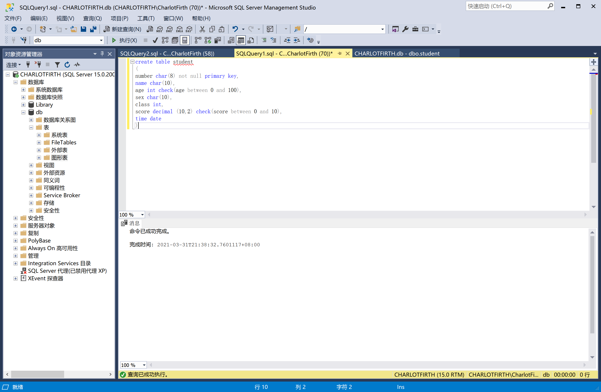

## Q2

执行SQL语句

```sql
alter table student
	add phonenumber char(11) check(len(phonenumber)=11 and PATINDEX('%[^0-9]%', phonenumber)=0) 
```

执行结果：


## Q3

执行SQL语句

```sql
insert into student (number,name,age,sex,class,score,time,phonenumber)
	values('19373073','何潇龙',19,'男',2,10,'2021-3-30','15224018918'),
	('17123456','赵一',19,'男',1,1.8,'2020-3-30','15224018919'),
	('17123465','钱二',19,'女',2,2,'2020-3-31','15224018920'),
	('12345618','孙三',18,'女',3,3,'2020-3-21','15224018921'),
	('12345638','李四',21,'女',1,2,'2020-3-21','15224018922'),
	('12345628','周五',22,'女',2,4,'2020-3-10','15224018923'),
	('20345628','周六',22,'女',2,2,'2020-3-10','15224018927'),
	('17182105','吴一',19,'男',3,5,'2020-3-21','15224018924'),
	('17123678','郑二',20,'男',2,2,'2020-3-31','15224018925'),
	('10123678','郑四',20,'男',2,1,'2020-3-31','15224018926');
```

执行结果：

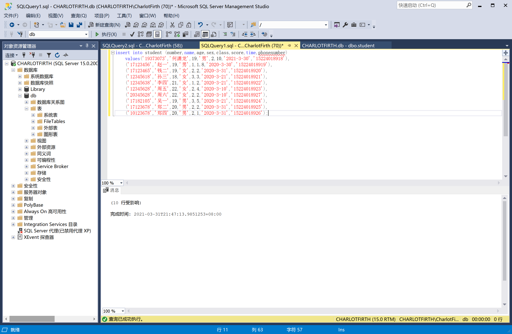

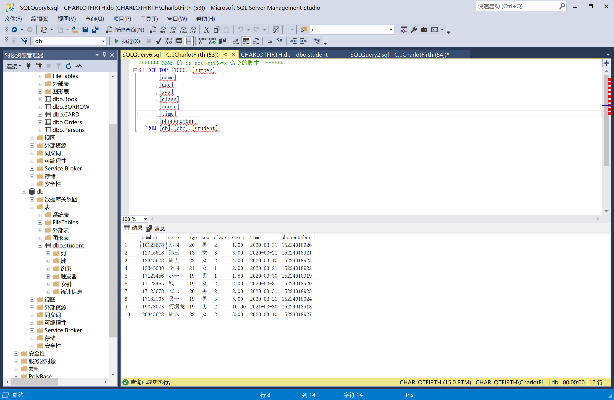

## Q4

执行SQL语句

```sql
update student
	set score +=1
	where score+1<=10
```

执行结果：

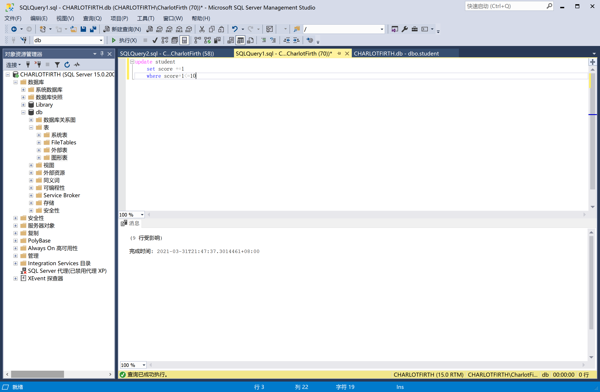


## Q5

执行SQL语句

```sql
select name,age
from student
where number like '2%' or age between 10 and 20
```

执行结果：

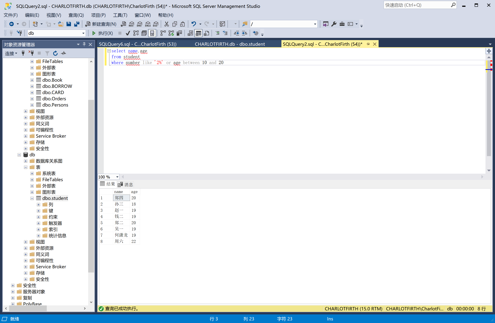

## Q6

执行SQL语句

```
select name
from student
where name like '%三%'
```

执行结果：


## Q7

执行SQL语句

```
select name
from student
where class=1 and sex='男'
```

执行结果：

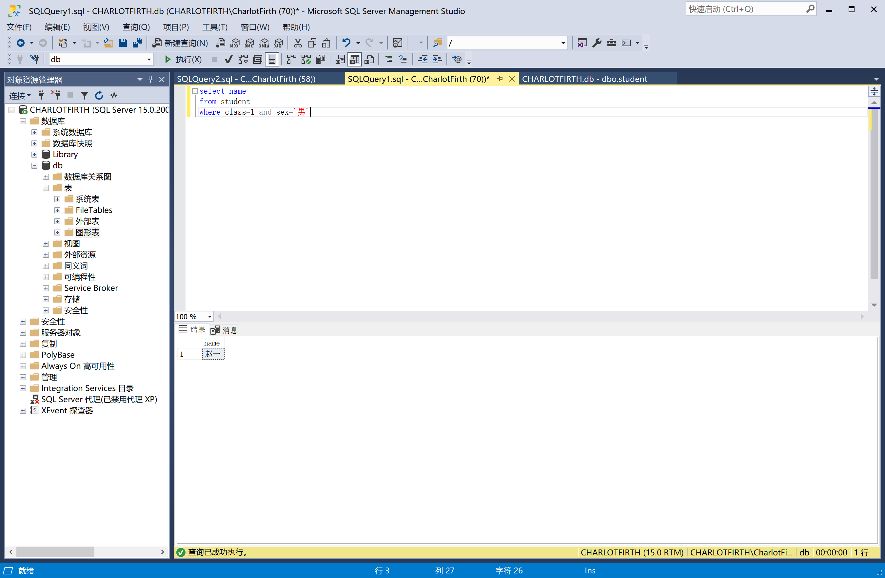

## Q8

执行SQL语句

```sql
delete from student
where number like '10%'
```

执行结果：

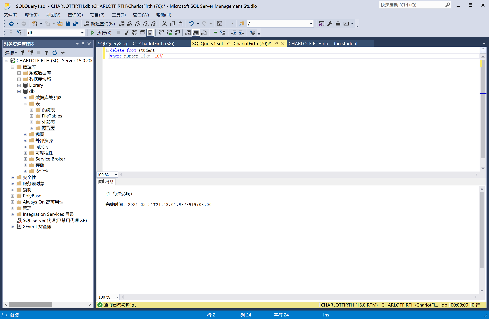

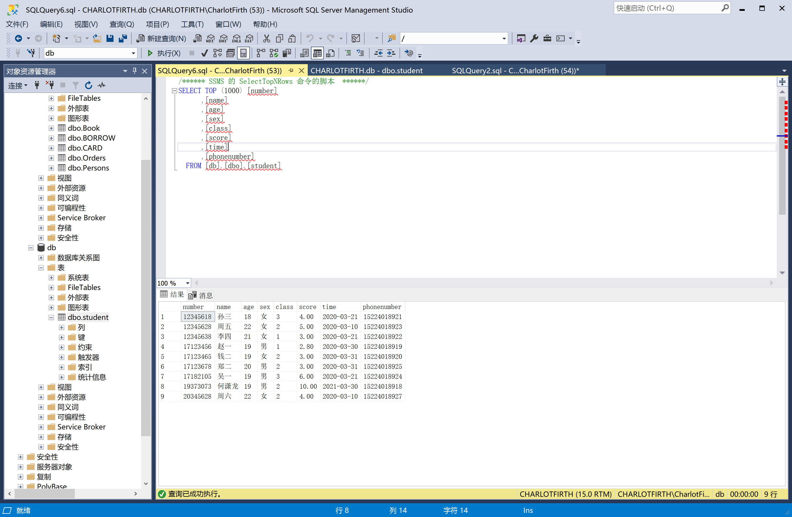

# TASK 2

数据导入：

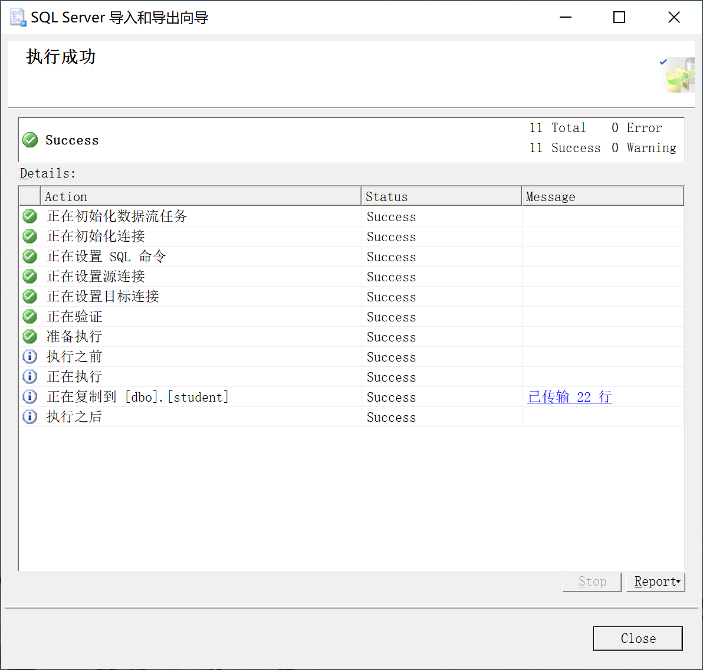

## Q9

执行SQL语句

```sql
select count(*)
from student
```

执行结果：

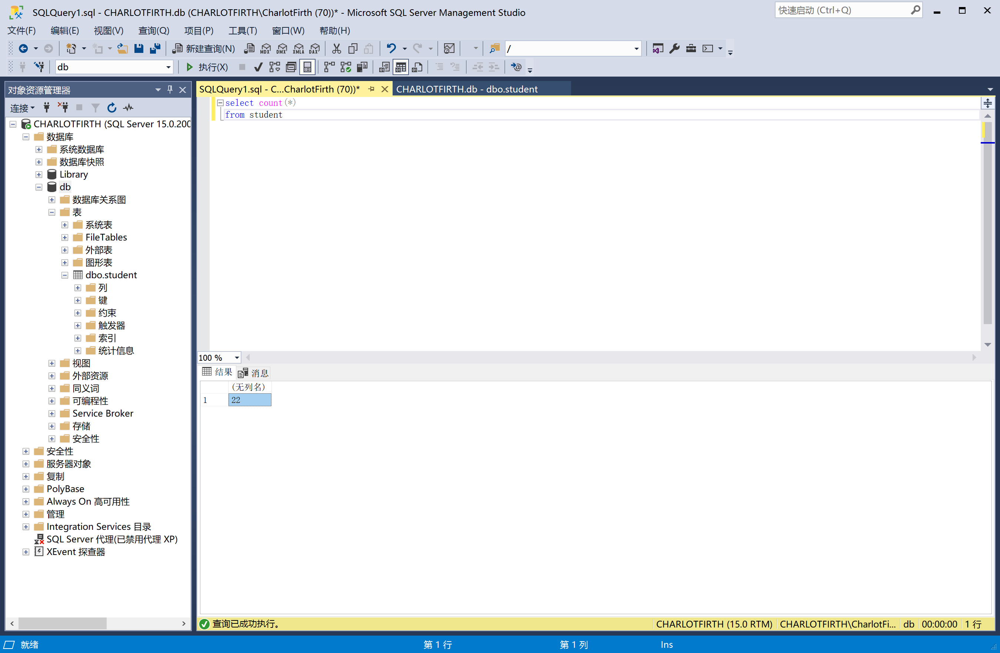

## Q10

执行SQL语句

```sql
select *
from student
where class='1'
```

执行结果：

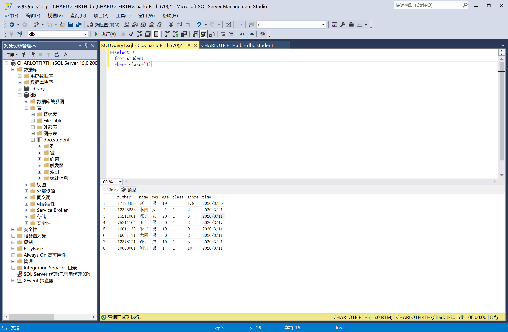

## Q11

执行SQL语句

因为没有改数据类型所以得把字符串先转成数字

```sql
select max(convert(decimal,score)) as max, min(convert(decimal,score)) as min
from student
where class='2'
```

执行结果：

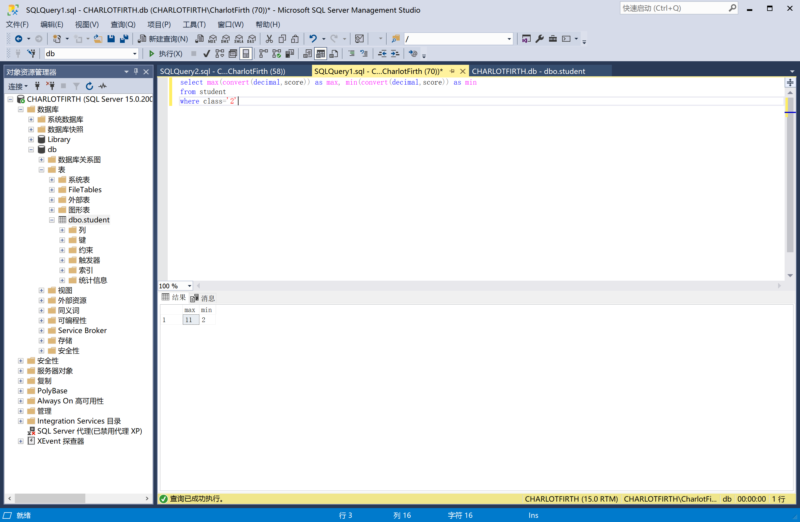

## Q12

执行SQL语句

因为没有改数据类型所以得把字符串先转成数字

```sql
select avg(convert(decimal,score)) as avg
from student
```

执行结果：


## Q13

执行SQL语句

```sql
select avg(convert(int,age)) as avgage
from student
```

执行结果：


## Q14

执行SQL语句

因为没有改过数据类型，所以先是字符串转日期再日期转字符串

```sql
select convert( char(10),convert(date,time,111),126) as year_month_day,convert(char(10),convert(date,time,111),112) as yearmonthday
from student
```

执行结果：

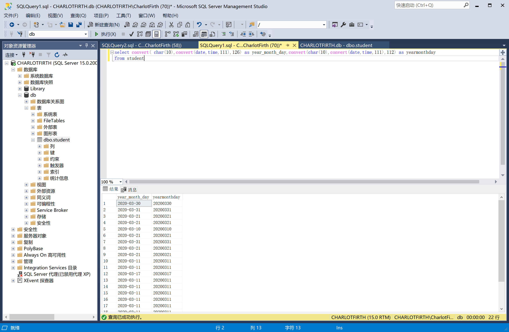