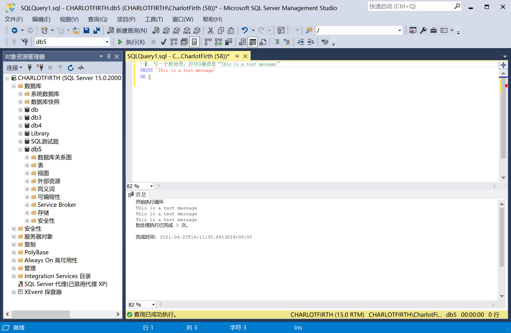
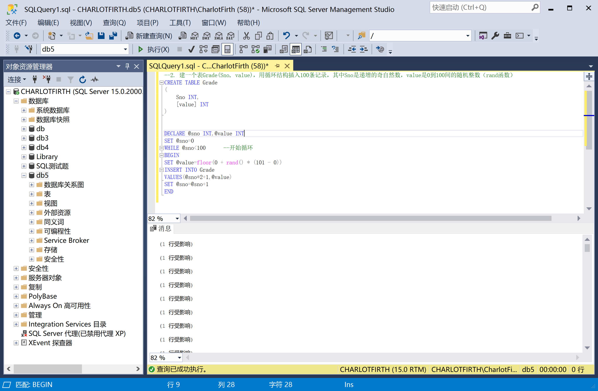
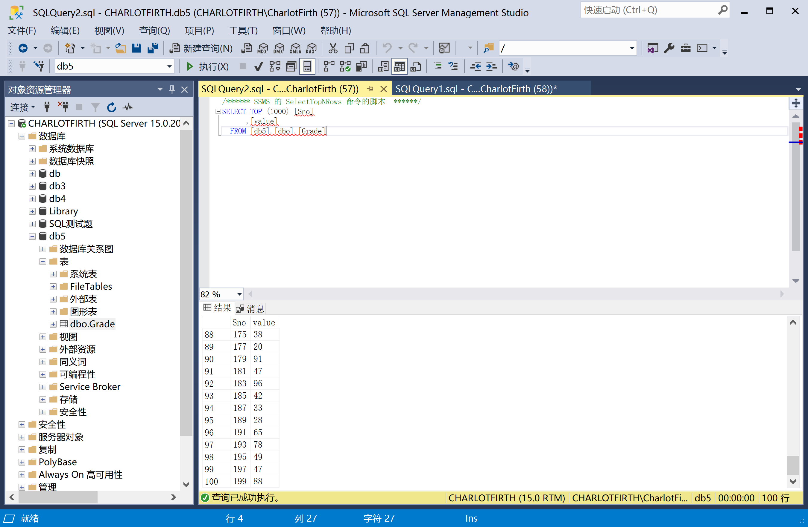
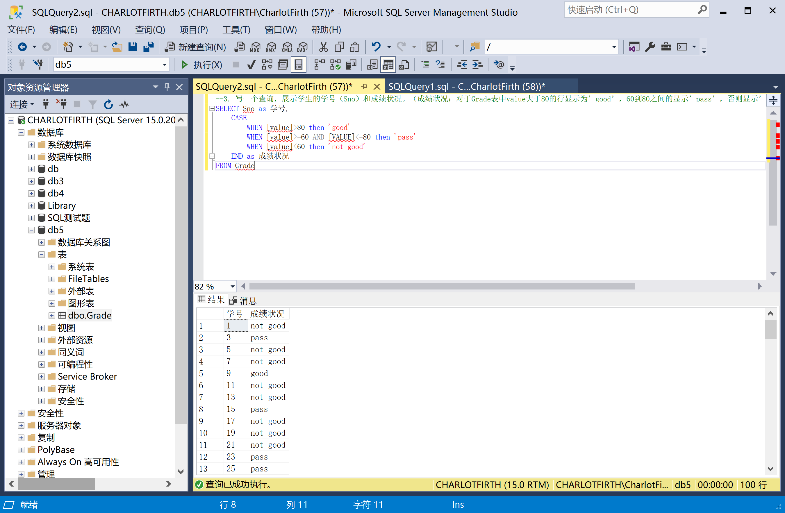
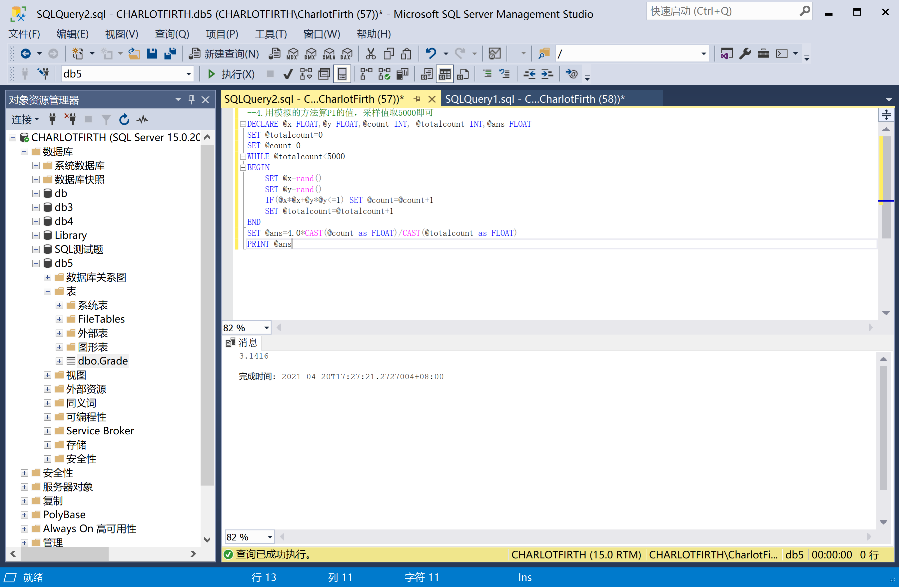

# **TASK1执行结果截图**

## 1、写一个批处理，打印3遍消息“This is a test message”

## 2. 建一个表Grade(Sno, value)，用循环结构插入100条记录，其中Sno是递增的奇自然数，value是0到100间的随机**整数**（rand函数）

插入的数据：

## 3. 写一个查询，展示学生的学号（Sno）和成绩状况。（成绩状况：对于Grade表中value大于80的行显示为’good’，60到80之间的显示’pass’，否则显示’not good’）

## 4. 用模拟的方法算PI的值，采样值取5000即可

（提示：计算落入四分之一圆形区域的点数的占比）

