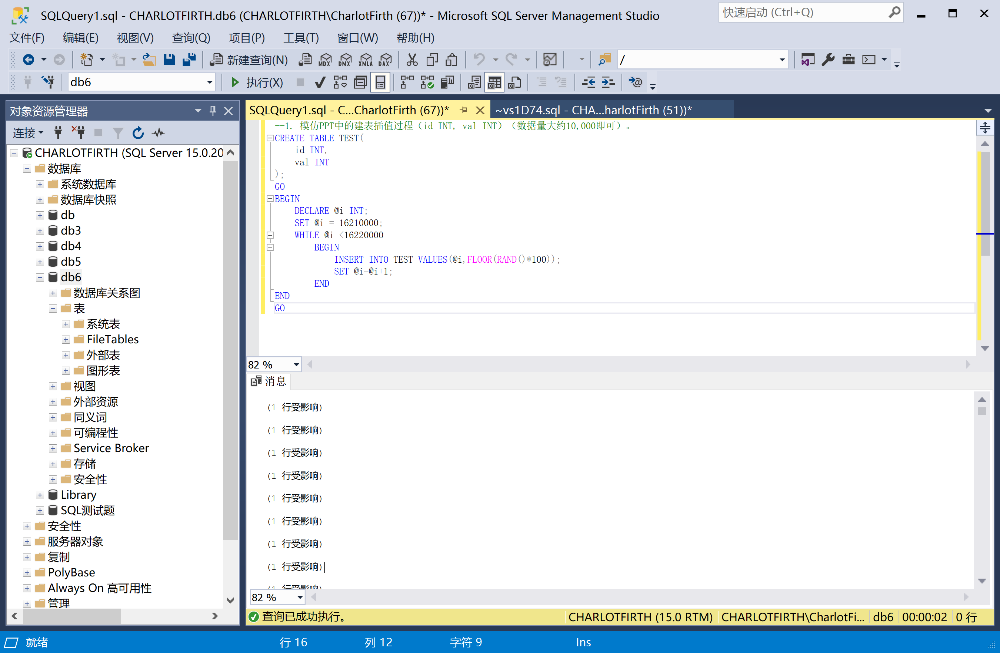

```sql
--1. 模仿PPT中的建表插值过程（id INT, val INT）（数据量大约10,000即可）。
CREATE TABLE TEST(
	id INT,
	val INT
);
GO
BEGIN
	DECLARE @i INT;
	SET @i = 16210000;
	WHILE @i <16220000
		BEGIN 
			INSERT INTO TEST VALUES(@i,FLOOR(RAND()*100));
			SET @i=@i+1;
		END
END
GO
```



--2. 建立id升序同时val降序的非聚类索引。

```sql
CREATE UNIQUE INDEX idx_tset_id ON TEST(id ASC,val DESC);
```

